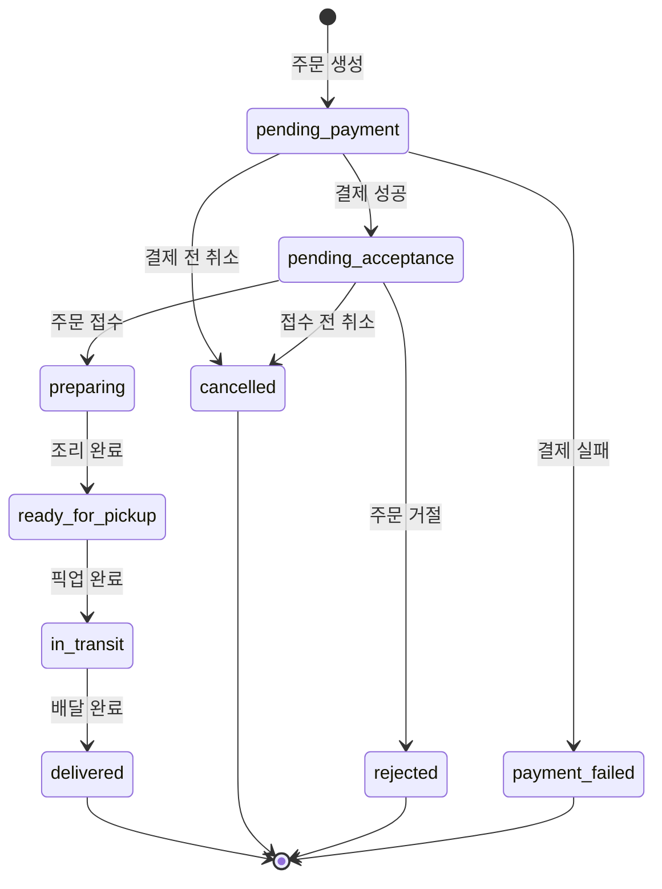

# REST API 심층 탐구: 실시간 주문 처리 시스템의 상태 전이와 동시성 제어
---
> 스터디를 진행하면서 직접 구현해보고 싶은 지문을 바탕으로 mvp모델을 구현해보았습니다.
- 스터디 참고링크 : [https://github.com/dong11hyun/DevStudy__CodeReview/tree/main/(%EC%B5%9C%EC%A2%85)%EC%8A%A4%ED%84%B0%EB%94%94%EC%9E%90%EB%A3%8C](https://github.com/dong11hyun/DevStudy__CodeReview/blob/main/(%EC%B5%9C%EC%A2%85)%EC%8A%A4%ED%84%B0%EB%94%94%EC%9E%90%EB%A3%8C/(1%ED%9A%8C%EC%B0%A8)Infra_Backend.md)
> 대규모 배달 플랫폼에서 발생할 수 있는 **동시성 문제**와 **데이터 정합성 이슈**를 
분석하고, 이를 해결하는 **RESTful API 설계 패턴**을 연구/구현한 프로젝트입니다.

> 배달 플랫폼처럼 여러 행위자(고객, 점주, 라이더)가 동시에 같은 리소스를 조작하는 시스템에서는 데이터 정합성 문제가 필연적으로 발생합니다.

> 이론으로만 알고 있던 동시성 제어, 멱등성 보장 패턴을
실제로 구현하고 테스트해보면서 깊이 있게 이해했던 프로젝트

> 제작 : 김동현 전대원 / 기간 : 2025_11 ~ 2026_01

## 📁목차

1. [🤔상황 및 문제점](#상황-및-문제점)
   - [문제 1. 모호한 상태 전이 API🔺](#문제-1-모호한-상태-전이-api)
   - [문제 2. 치명적인 동시성 문제🔺](#문제-2-치명적인-동시성-문제-race-condition)
   - [문제 3. 멱등성 부재🔺](#문제-3-멱등성idempotency-부재)
   - [문제 4. 데이터 로딩 비효율🔺](#문제-4-데이터-로딩-비효율-n1-문제)
2. [🧐해결 과정](#해결-과정)
   - [질문 1: 행위 기반 리소스 설계](#질문-1-행위-기반-리소스-설계)
   - [질문 2: 멱등성 보장](#질문-2-멱등성idempotency-보장)
   - [질문 3: 낙관적 락 구현](#질문-3-낙관적-락optimistic-locking-구현)
   - [질문 4: N+1 문제 해결 전략](#질문-4-n1-문제-해결-전략)
   - [질문 5: API 버전 관리 전략](#질문-5-api-버전-관리-전략)
3. [📖 프로젝트 구조 & 구현](#-프로젝트-구조--구현)
   - [핵심 행위자🔹](#-핵심-행위자-actors)
   - [주문 생명주기🔹](#-주문order의-핵심-생명주기)
   - [실행 가이드🔹](#-실행-가이드)
   - [주요 엔드포인트🔹](#-주요-엔드포인트)
   - [구현 현황🔹](#-구현-현황)
   - [향후 확장 및 개선 계획🔹](#-향후-확장-및-개선-계획-future-plans)

## 🤔상황 및 문제점

- 당신은 국내 최대 음식 배달 플랫폼 **QuickEats** 의 주문 처리 마이크로서비스를 담당하는 백엔드 엔지니어입니다. 
- 이 서비스는 고객, 레스토랑, 라이더라는 세 명의 행위자(Actor) 사이의 복잡한 상호작용을 관장합니다.
- 주문의 전체 생명주기를 관리하는 **REST API**를 외부에 제공합니다.
- 서비스 V1 API는 초기에 빠른 개발을 위해 **주문(Order)이라는 단일 리소스**를 중심으로 설계되었습니다. 
- 하지만 일일 주문량이 수백만 건을 넘어서면서, **V1 API의 설계적 한계**가 명확한 기술 부채로 돌아오고 있습니다.

이러한 문제들을 해결하기 위해, 
- 비즈니스 규칙을 명확히 표현하고, 
- 동시성을 안전하게 처리하며, 
- 클라이언트와 효율적으로 소통하는 **V2 API**를 설계해야 합니다.


#### 🔺문제 1. 모호한 상태 전이 API

**현재 방식:**
```http
PUT /api/v1/orders/{order_id}
Content-Type: application/json

{ "status": "new_status" }
```

**문제점:**
- 모든 상태 변경이 단일 엔드포인트에서 처리됨
- 서버 비즈니스 로직이 거대한 `if-else` 분기문으로 가득 참
- 고객의 '주문 취소'와 라이더의 '픽업 완료'가 동일한 API 사용
- 논리적 구분이 모호함

---

#### 🔺문제 2. 치명적인 동시성 문제 (Race Condition)

**시나리오:**
```
시간 T0: 고객이 {"status": "cancelled"} 요청 전송
시간 T0: 레스토랑이 {"status": "preparing"} 요청 전송 (거의 동시에)
결과: 데이터베이스 최종 상태 예측 불가
```

**결과:**
- 이미 취소된 주문의 음식이 조리됨
- 심각한 데이터 불일치 문제 발생

**실제 테스트 결과 (V1 API):**
```
=== 동시성 테스트 시작 (Race Condition) ===
[고객] '취소해주세요!' 요청 보냄
 [사장님] '주문 접수!' 요청 보냄
[고객] 응답 받음: cancelled     ← 고객은 취소 성공으로 인식
 [사장님] 응답 받음: preparing   ← 사장님은 접수 성공으로 인식

===  최종 결과 확인 ===
DB에 저장된 최종 상태: preparing   ← 실제로는 조리 시작됨!
```
>  **치명적 불일치**: 고객은 취소된 줄 알지만, 주방에서는 치킨을 튀기고 있습니다.
> 테스트 실행: `python black_BOX_test_v1.0.py`

---

#### 🔺문제 3. 멱등성(Idempotency) 부재

**문제 시나리오:**
1. 고객이 결제 요청 전송
2. 네트워크 문제로 타임아웃 발생
3. 클라이언트 앱이 안전하게 재시도
4. `POST /api/v1/orders/{order_id}/pay`가 멱등성 미보장
5. **중복 결제 발생 → 금융 사고**

---

#### 🔺문제 4. 데이터 로딩 비효율 (N+1 문제)

**현재 상황:**
- `GET /api/v1/orders`는 `restaurant_id`와 `rider_id`만 반환
- 클라이언트가 N개 주문에 대해 추가 N번의 API 호출 필요
  - 레스토랑 정보 조회 × N
  - 라이더 위치 조회 × N

```
총 API 호출 수 = 1 (주문 목록) + N (레스토랑) + N (라이더) = 2N + 1
```
---

## 🧐해결 과정

### 질문 1: 행위 기반 리소스 설계
- V1 API의 모호한 상태 전이 문제를 해결하기 위해, 주문의 생명주기를 RESTful하게 표현하는 API를 새롭게 설계
- PUT 메서드에 의존하는 대신, 주문의 상태를 변경시키는 각 **'행위' 자체를 리소스로 간주하는 '행위 기반 리소스(Action-oriented Resource)' 접근법**을 사용하여 API 엔드포인트를 설계 
- 예를 들어, 레스토랑의 '주문 접수' 행위나 고객의 '주문 취소' 행위를 위한 구체적인 엔드포인트(HTTP 메서드와 URI 경로)를 제시하고, 이러한 설계가 왜 V1에 비해 시스템의 비즈니스 규칙을 더 명확하게 만들고 확장성을 높이는지 설명


**[답변]**
>기존 V1 API에서는 모든 상태 변경이 `PUT /api/v1/orders/{order_id}`라는 단일 엔드포인트에서 `{ "status": "new_status" }` 형태로 처리되었습니다. 이 방식은 빠른 개발에는 유리하지만, 시스템이 커지면서 심각한 문제를 야기합니다. 서버 코드는 전달받은 status 값에 따라 분기해야 하므로 거대한 if-else 블록이 생기고, 누가 어떤 상태로 변경할 수 있는지에 대한 비즈니스 규칙이 코드 깊숙이 숨겨지게 됩니다.

>행위 기반 리소스 설계는 이러한 문제를 근본적으로 해결합니다. 핵심 아이디어는 **상태를 변경하는 '행위' 자체를 하나의 리소스로 간주**하는 것입니다. 
> - ex.) 고객이 주문을 취소하는 행위는 `POST /api/v2/orders/{order_id}/cancellation`
> - 레스토랑이 주문을 접수하는 행위는 `POST /api/v2/orders/{order_id}/acceptance` 
> - 각 행위가 별도의 엔드포인트를 가지므로, 해당 엔드포인트의 컨트롤러에서는 오직 그 행위에 필요한 비즈니스 로직만 담당 가능.

>결론적으로, 행위 기반 리소스 설계는 REST의 원칙을 유지하면서도 복잡한 상태 기계(State Machine)를 가진 시스템을 깔끔하게 표현할 수 있는 강력한 패턴.

---
> PUT 메서드에 의존하는 대신, 주문의 상태를 변경시키는 각 **'행위' 자체를 리소스**로 간주

**설계 예시:**

| 행위 | HTTP 메서드 | 엔드포인트 | 행위자 |
|------|-------------|-----------|--------|
| 주문 생성 | `POST` | `/api/v2/orders` | 고객 |
| 결제 요청 | `POST` | `/api/v2/orders/{order_id}/payment` | 고객 |
| 주문 취소 | `POST` | `/api/v2/orders/{order_id}/cancellation` | 고객 |
| 주문 접수 | `POST` | `/api/v2/orders/{order_id}/acceptance` | 레스토랑 |
| 주문 거절 | `POST` | `/api/v2/orders/{order_id}/rejection` | 레스토랑 |
| 조리 완료 | `POST` | `/api/v2/orders/{order_id}/preparation-complete` | 레스토랑 |
| 픽업 완료 | `POST` | `/api/v2/orders/{order_id}/pickup` | 라이더 |
| 배달 완료 | `POST` | `/api/v2/orders/{order_id}/delivery` | 라이더 |

**장점:**
- 각 행위별로 명확한 비즈니스 규칙 적용 가능
- 권한 검증이 용이 (행위자별 엔드포인트 분리)
- 확장성 향상 (새로운 행위 추가 시 기존 코드 영향 최소화)

---

### 질문 2: 멱등성(Idempotency) 보장
- **행위를 리소스로 격상시켜 POST로 처리한다"** 는 것은 설계의 명확성을 얻는 대신, HTTP 프로토콜이 기본적으로 보장하던 🤔 **'멱등성(Idempotency)'을 포기**
- 결제 재시도 시 중복 처리 문제를 방지하기 위해 **멱등성을 어떻게 보장할 것**인지 설명하시오. 
- 클라이언트가 네트워크 오류 발생 시 안전하게 재시도할 수 있도록, `POST /api/v2/orders/{order_id}/payment`와 같은 엔드포인트를 어떻게 수정해야 하는지 **Idempotency-Key 헤더를 활용하는 표준적인 방법**을 통해 그 요청-응답 흐름과 서버 측의 처리 로직을 상세히 기술.

**[답변]**
> 멱등성(Idempotency)이란 동일한 요청을 여러 번 실행하더라도 결과가 한 번 실행한 것과 동일하게 유지되는 성질입니다. HTTP의 GET, PUT, DELETE 메서드는 설계상 멱등성을 가지지만, POST는 그렇지 않습니다. 문제는 결제와 같이 부작용(side effect)이 있는 작업에서 네트워크 오류가 발생했을 때입니다. 클라이언트는 요청이 성공했는지 실패했는지 알 수 없어 재시도를 하게 되고, 이로 인해 중복 결제가 발생할 수 있습니다.

> 이 문제를 해결하는 표준적인 방법이 **Idempotency-Key 헤더**입니다. 
동작 원리는 다음과 같습니다. 
> 1. 클라이언트는 결제 요청을 보낼 때 고유한 Idempotency-Key를 생성하여 헤더에 포함시킵니다(예: UUID). 
> 2. 서버는 이 요청을 처리하기 전에 먼저 해당 키가 이미 처리된 적이 있는지 저장소(Redis, DB 등)에서 확인.
> - 만약 키가 존재하지 않으면, 서버는 결제를 정상적으로 처리하고, 그 키와 함께 응답 결과를 저장소에 기록합니다. 
> - 반면 키가 이미 존재한다면, 이것은 재시도 요청으로 간주되어 실제 결제 로직을 실행하지 않고 **이전에 저장해둔 응답을 그대로 반환**합니다.

> 이 흐름의 핵심은 클라이언트가 동일한 Idempotency-Key로 여러 번 요청을 보내더라도 서버에서는 단 한 번만 실제 처리가 이루어진다는 점입니다. 네트워크 타임아웃으로 클라이언트가 응답을 받지 못하고 재시도를 하더라도, 첫 번째 요청이 성공적으로 처리되었다면 두 번째 요청은 저장된 성공 응답을 받게 되고, 첫 번째 요청이 실패했다면 두 번째 요청이 새로운 처리로 진행됩니다.

> 서버 구현 시 고려해야 할 점은 Idempotency-Key의 유효 기간 설정(보통 24시간~7일), 그리고 요청이 처리 중일 때 동일한 키로 다른 요청이 들어온 경우를 처리하기 위한 락(Lock) 메커니즘입니다. 이러한 구현을 통해 클라이언트는 안심하고 재시도를 수행할 수 있으며, 중복 결제로 인한 금융 사고를 원천적으로 예방할 수 있습니다.

---
**요청-응답 흐름:**

```http
POST /api/v2/orders/{order_id}/payment
Content-Type: application/json
Idempotency-Key: "unique-request-id-12345"

{
  "payment_method": "card",
  "amount": 25000
}
```

**서버 측 처리 로직:**

```
1. Idempotency-Key 확인
2. 키가 저장소에 존재하는지 확인
   ├─ 존재함 → 저장된 응답 반환 (재시도로 간주)
   └─ 존재 안함 → 요청 처리 진행
3. 요청 처리 및 결과 저장
4. Idempotency-Key와 함께 응답 저장소에 기록
5. 응답 반환
```

**재시도 시:**
- 동일한 `Idempotency-Key`로 요청
- 서버가 저장된 응답 반환
- 중복 결제 방지

**실제 테스트 결과 (V2 API):**
```
=== 멱등성 테스트 시작 (Idempotency) ===
테스트용 주문 생성 완료: ID 13
초기 상태: pending_payment
생성된 Idempotency-Key: bb9e65b7-5e28-46d2-a25c-33fa1d89b5fb

[요청 1] 첫 번째 결제 요청 전송...
[결과 1] 성공 (200 OK). 상태: pending_acceptance

[요청 2] 두 번째 결제 요청 전송 (동일 키)...
[결과 2] 성공 (200 OK).
[검증] 응답 본문이 첫 번째와 완전히 동일함. (시간, 상태 등)
[검증] Version 변화 없음 (2 -> 2). 멱등성 동작 확인!
```
>  **중복 결제 방지**: 동일한 키로 재요청해도 실제 처리는 1번만 수행됨.
> 테스트 실행: `python black_BOX_test_v2.0.py`

---

### 질문 3: 낙관적 락(Optimistic Locking) 구현
- 고객의 '주문 취소'와 레스토랑의 '주문 접수'가 충돌하는 것과 같은 **동시성 문제를 해결하기 위한 낙관적 락(Optimistic Locking) 전략**을 API 수준에서 어떻게 구현할 수 있을지 설명하시오. 
- HTTP의 **ETag와 If-Match 조건부 요청 헤더**를 사용하여, 클라이언트가 항상 리소스의 최신 버전을 기반으로 상태 변경을 시도하도록 보장하는 전체적인 과정을 설명해야 합니다. 
- 만약 클라이언트가 오래된 버전의 정보를 기반으로 요청했을 때, 서버가 **412 Precondition Failed** 응답을 반환하여 충돌을 방지하는 시나리오를 포함하여 논하시오.

**[답변]**

> 동시성 문제는 여러 행위자가 동일한 리소스를 거의 동시에 변경하려 할 때 발생합니다. QuickEats의 경우, 고객이 주문을 취소하려는 순간 레스토랑이 주문을 접수하는 상황이 대표적입니다. 두 요청이 모두 "주문 접수 대기중(pending_acceptance)" 상태에서 출발하지만, 결과적으로 하나만 유효해야 합니다. 이를 해결하는 방법으로 크게 비관적 락(Pessimistic Locking)과 낙관적 락(Optimistic Locking)이 있는데, 웹 API 환경에서는 낙관적 락이 더 적합합니다.

> 낙관적 락의 철학은 "충돌은 드물게 발생한다"고 가정하고, 충돌이 발생했을 때 이를 감지하여 처리하는 것입니다. HTTP 표준에서는 이를 위해 **ETag(Entity Tag)** 와 **If-Match** 헤더를 제공합니다. ETag는 리소스의 특정 버전을 식별하는 고유한 값으로, 리소스가 변경될 때마다 함께 갱신됩니다.

> 동작 과정
> 1. 먼저 클라이언트가 주문 정보를 조회하면(`GET /api/v2/orders/{order_id}`), 서버는 응답 헤더에 현재 리소스의 ETag 값(예: `"abc123"`)을 포함하여 반환합니다. >
> 2. 클라이언트는 이후 상태 변경 요청을 보낼 때, 자신이 받았던 ETag 값을 `If-Match` 헤더에 담아 전송합니다(예: `If-Match: "abc123"`). 
> 3. 서버는 요청을 처리하기 전에 데이터베이스에 저장된 현재 리소스의 버전과 If-Match 헤더의 값을 비교합니다. 
> - 두 값이 일치하면 요청을 정상 처리하고 새로운 ETag를 발급합니다. 
> - 만약 일치하지 않는다면, 이는 클라이언트가 리소스를 조회한 이후 다른 누군가가 이미 변경했다는 것을 의미하므로, 서버는 **412 Precondition Failed** 응답을 반환합니다.

> 구체적인 시나리오를 들어보겠습니다. 고객 앱과 레스토랑 앱이 거의 동시에 주문 정보를 조회하여 둘 다 ETag `"abc123"`을 받았습니다. 레스토랑이 먼저 주문 접수 요청을 보내면, 서버는 이를 성공적으로 처리하고 ETag를 `"def456"`으로 갱신합니다. 잠시 후 고객이 취소 요청을 `If-Match: "abc123"`과 함께 보내면, 서버는 현재 ETag `"def456"`과 일치하지 않음을 확인하고 412 응답을 반환합니다. 고객 앱은 이 응답을 받고 사용자에게 "이미 주문이 접수되었습니다. 취소할 수 없습니다."라는 메시지를 표시할 수 있습니다.

> 이 방식은 데이터베이스 수준의 락을 장시간 유지하지 않으므로 시스템 처리량에 미치는 영향이 적으며, HTTP 표준을 활용하므로 RESTful한 설계를 유지할 수 있습니다.

---

**전체 흐름:**

#### Step 1: 리소스 조회 (ETag 수신)
>  참고: 아래 ETag 값(abc123xyz, def456uvw 등)은 설명용 예시
     실제 구현에서는 hashlib.md5(f"order-{id}-v{version}".encode()).hexdigest() 형태의 MD5 해시가 사용됨.
```http
GET /api/v2/orders/{order_id}

HTTP/1.1 200 OK
ETag: "abc123xyz"  # 예시 값 (실제: MD5 해시)
Content-Type: application/json

{
  "id": "order-123",
  "status": "pending_acceptance",
  "version": 5
}
```

#### Step 2: 상태 변경 요청 (If-Match 포함)
```http
POST /api/v2/orders/{order_id}/cancellation
If-Match: "abc123xyz"
Content-Type: application/json

{
  "reason": "고객 변심"
}
```

#### 성공 시나리오:
```http
HTTP/1.1 200 OK
ETag: "def456uvw"

{
  "id": "order-123",
  "status": "cancelled"
}
```

#### 충돌 시나리오 (412 Precondition Failed):
```http
HTTP/1.1 412 Precondition Failed
Content-Type: application/json

{
  "error": "conflict",
  "message": "리소스가 이미 변경되었습니다. 최신 버전을 조회 후 다시 시도하세요.",
  "current_status": "preparing"
}
```

**충돌 방지 메커니즘:**
- 고객 취소 요청과 레스토랑 접수 요청이 동시에 오면
- 먼저 처리된 요청이 ETag 갱신
- 나중에 처리되는 요청은 If-Match 불일치로 412 반환

---

### 질문 4: N+1 문제 해결 전략
클라이언트 앱의 N+1 조회 문제를 해결하기 위한 **두 가지 서로 다른 데이터 제공 전략**을 제시하고 비교하시오.
- **첫 번째**: RESTful API의 유연성을 유지하면서 관련 리소스를 함께 포함하여 전달하는 **'컴파운드 도큐먼트(Compound Document)' 또는 '사이드로딩(Side-loading)'** 방식을 `?include=restaurant,rider`와 같은 쿼리 파라미터를 통해 어떻게 구현할 수 있는지 설명해야 합니다.
- **두 번째**: 대안적인 아키텍처로서 **GraphQL**을 도입한다면 이 문제가 어떻게 더 근본적으로 해결될 수 있는지, 클라이언트가 필요한 데이터의 구조를 직접 정의하는 GraphQL의 특징을 중심으로 두 방식의 장단점을 기술하시오.

**[답변]**

> N+1 문제는 REST API에서 흔히 발생하는 성능 이슈입니다. 주문 목록 화면에서 N개의 주문과 함께 각 주문의 레스토랑 이름, 라이더 위치를 보여줘야 한다면, 기존 V1 API로는 1번(주문 목록) + N번(레스토랑 조회) + N번(라이더 조회) = 2N+1번의 API 호출이 필요합니다. 이는 네트워크 지연을 누적시키고 서버 부하를 증가시킵니다.

> **첫 번째 해결책은 사이드로딩(Side-loading) 방식**입니다. 이 방식은 쿼리 파라미터를 통해 함께 조회할 관련 리소스를 지정할 수 있게 합니다. 예를 들어 `GET /api/v2/orders?include=restaurant,rider`로 요청하면, 서버는 주문 데이터와 함께 관련된 레스토랑과 라이더 정보를 응답에 포함시킵니다. 응답 구조는 기본 데이터(`data`)와 포함된 리소스(`included`)로 분리됩니다. 
> - **장점**은 기존 REST 아키텍처를 유지하면서 점진적으로 도입할 수 있다는 것입니다. 또한 클라이언트가 **필요할 때만** 관련 리소스를 **요청**할 수 있으므로 유연합니다. 
> - **단점**은 서버에서 지원하는 include 옵션의 조합에 제한이 있을 수 있고, 불필요한 필드까지 모두 전송될 수 있다는 점입니다.

> **두 번째 해결책은 GraphQL 도입**입니다. GraphQL은 클라이언트가 필요한 데이터의 구조를 직접 쿼리로 정의하는 방식입니다. 클라이언트는 "주문의 id, status, 그리고 레스토랑의 name, 라이더의 name과 currentLocation만 필요하다"고 명시적으로 요청할 수 있습니다. 서버는 정확히 요청된 데이터만 반환하므로, 과다 전송(Over-fetching)과 부족 전송(Under-fetching) 문제가 본질적으로 해결됩니다.

> 두 방식을 비교하면,
>- **사이드로딩**은 기존 REST 인프라를 활용할 수 있어 도입 비용이 낮지만 유연성에 한계가 있습니다. 
>- **GraphQL**은 클라이언트에게 최대의 유연성을 제공하지만, 새로운 스키마 설계, 학습 비용, 캐싱 전략 재고려 등 도입 장벽이 높습니다. 또한 GraphQL은 단일 엔드포인트로 동작하므로 HTTP 캐싱이 어렵고, 복잡한 쿼리로 인한 서버 부하를 제어하기 위해 쿼리 복잡도 분석 기능이 필요할 수 있습니다.

> 실무에서는 시스템의 복잡도와 팀의 역량에 따라 선택합니다. 상대적으로 단순한 관계를 가진 시스템이나 이미 REST에 익숙한 팀이라면 사이드로딩이 현실적인 선택이고, 다양한 클라이언트(웹, 모바일, 태블릿)가 각기 다른 데이터를 필요로 하는 복잡한 시스템이라면 GraphQL이 장기적으로 더 효율적일 수 있습니다.

---

#### 방법 1: 컴파운드 도큐먼트 / 사이드로딩 (Side-loading)

**요청:**
```http
GET /api/v2/orders?include=restaurant,rider
```

**응답:**
```json
{
    "results": [
        {
            "id": 14,
            "restaurant_name": "모수",
            "status": "pending_acceptance",
            "created_at": "2026-01-19T13:21:32.476987Z",
            "version": 2,
            "restaurant": 1,
            "rider": 1
        }
    ],
    "included": {
        "restaurants": [
            {
                "id": 1,
                "name": "모수",
                "address": "서울시 영등포구"
            }
        ],
        "riders": [
            {
                "id": 1,
                "name": "배민라이더"
            }
        ]
    }
}
```

---

#### 방법 2: GraphQL 도입

**요청:**
```graphql
query {
  orders {
    id
    status
    restaurant {
      name
      address
    }
    rider {
      name
      currentLocation {
        lat
        lng
      }
    }
  }
}
```

**응답:**
```json
{
  "data": {
    "orders": [
      {
        "id": "order-123",
        "status": "in_transit",
        "restaurant": {
          "name": "맛있는 치킨집",
          "address": "서울시 강남구..."
        },
        "rider": {
          "name": "김배달",
          "currentLocation": { "lat": 37.5, "lng": 127.0 }
        }
      }
    ]
  }
}
```


#### 선택: 사이드로딩

> 이 프로젝트에서는 **사이드로딩 방식**을 선택하여 구현했습니다.

**두 방식 비교:**

| 비교 항목 | 사이드로딩 | GraphQL |
|----------|-----------|---------|
| **원리** | `?include=` 쿼리 파라미터로 관련 리소스 요청 | 클라이언트가 필요한 데이터 구조를 직접 쿼리로 정의 |
| **장점** | RESTful 원칙 유지, 기존 인프라 활용, 구현 단순 | 과다/부족 전송 근본 해결, 강력한 타입 시스템, 복잡한 데이터 한 번에 조회 |
| **단점** | 서버 지원 조합만 가능, 과다 전송(Over-fetching) 가능 | 학습 곡선 존재, 캐싱 복잡, 서버 복잡도 증가 |

**선택 근거:**

| 기준 | 사이드로딩 | GraphQL |
|-----|-----------|---------|
| **기존 인프라 활용** | Django REST Framework 그대로 사용 | 🔺 새로운 스키마/리졸버 설계 필요 |
| **학습 비용** |  낮음 (쿼리 파라미터만 추가) |  🔺 높음 (새로운 패러다임) |
| **구현 복잡도** |  간단 (`?include=` 파싱 + `select_related`) |  🔺 복잡 (스키마, 리졸버, DataLoader) |
| **프로젝트 규모** |  MVP 수준에 적합 | 대규모 서비스에 적합 |
| **HTTP 캐싱** |  표준 캐싱 가능 |  🔺 별도 캐싱 전략 필요 |

> 본 프로젝트는 **동시성 제어와 멱등성 보장**이 핵심 목표이며, N+1 문제 해결은 부가적인 개선 사항입니다. 따라서 최소한의 변경으로 효과를 얻을 수 있는 **사이드로딩 방식**이 적합합니다. GraphQL은 다양한 클라이언트(웹, 앱, 태블릿)가 각기 다른 데이터를 필요로 하는 대규모 서비스로 확장될 때 고려할 수 있습니다.

---

### 질문 5: API 버전 관리 전략
- 기존 V1 API를 사용하는 구버전 앱 사용자들을 중단 없이 지원하면서, 새로운 V2 API를 안전하게 출시하기 위한 **API 버전 관리 전략**을 제시하시오. 
- 가장 널리 사용되는 **URI 경로 기반 버전 관리**(예: `/api/v2/...`) 방식의 장점을 설명하고, 이를 Django와 같은 웹 프레임워크에서 어떻게 구현할 수 있는지 기술해야 합니다.

**[답변]**

> API 버전 관리는 기존 사용자의 서비스 연속성을 보장하면서 새로운 기능을 안전하게 배포하기 위해 필수적입니다. API 버전 관리에는 여러 방법이 있습니다. URI 경로에 버전을 포함하는 방식(`/api/v1/`, `/api/v2/`), 쿼리 파라미터 방식(`?version=2`), 커스텀 헤더 방식(`X-API-Version: 2`), Accept 헤더의 미디어 타입 방식(`Accept: application/vnd.quickeats.v2+json`) 등이 있습니다.

> 이 중 **URI 경로 기반 버전 관리**가 가장 널리 사용되는 이유는 명확합니다. 
> 1.  직관적이고 가시성이 높습니다. URL만 보고도 어떤 버전의 API를 사용하는지 즉시 알 수 있습니다. 
> 2.  브라우저에서 쉽게 테스트할 수 있습니다. 별도의 헤더 설정 없이 주소창에 직접 입력하여 결과를 확인할 수 있습니다. 
> 3.  캐싱 정책을 버전별로 독립적으로 적용할 수 있습니다. CDN이나 프록시 서버에서 URL 기반 캐싱이 자연스럽게 이루어집니다. 
> 4.  로드 밸런서나 API 게이트웨이에서 버전별 라우팅을 쉽게 구성할 수 있습니다.

> Django에서 이를 구현하는 방법은 간단합니다. 버전별로 별도의 앱 또는 모듈을 만들고, 최상위 URL 설정에서 각 버전에 해당하는 경로를 라우팅합니다. 예를 들어 `api/v1/` 경로는 v1 모듈의 URL 설정으로, `api/v2/` 경로는 v2 모듈의 URL 설정으로 연결합니다. 이렇게 하면 V1과 V2의 코드가 물리적으로 분리되어, 한 버전의 수정이 다른 버전에 영향을 주지 않습니다.


---
#### URI 경로 기반 버전 관리

```
/api/v1/orders  →  기존 사용자 지원
/api/v2/orders  →  새로운 기능
```

**장점:**
- 명확하고 직관적
- 브라우저에서 쉽게 테스트 가능
- 캐싱 정책 버전별 독립 적용 가능
- 로드 밸런서에서 버전별 라우팅 용이


**urls.py (orders/urls.py):**
```python
...
urlpatterns = [
    path('v1/', include(router.urls)),           # /api/v1/orders/
    path('v2/', include('orders.api.v2.urls')),  # /api/v2/orders/
]
```
```
═══════════════════════════════════════════════════════════════════════════════════
  2025.11          2026.01          2026.07          2027.01
     │                │                │                │
     ▼                ▼                ▼                ▼
  ┌──────┐        ┌──────┐        ┌──────┐        ┌──────┐
  │ V2   │        │ V1+V2│        │ V1   │        │ V1   │
  │ 개발 │───────▶│ 병렬 │───────▶│ 경고 │───────▶│ 종료 │
  └──────┘        └──────┘        └──────┘        └──────┘
                  (6개월)         (6개월~1년)
**버전 전환 전략:**
1. V2 API 개발 및 테스트
2. V1과 V2 동시 운영 (병렬 운영 기간)
3. 신규 앱 버전에서 V2 사용
4. V1 사용률 모니터링
5. V1 Deprecation 공지
6. 충분한 유예 기간 후 V1 종료
```
---


## 📖 프로젝트 구조 & 구현 

### 🔹 핵심 행위자 (Actors)
| 행위자 | 역할 |
|--------|------|
| 고객 (Customer) | 주문 생성, 결제, 취소 |
| 레스토랑 (Restaurant) | 주문 접수/거절, 조리 |
| 라이더 (Rider) | 픽업, 배달 |

### 🔹 주문(Order)의 핵심 생명주기



| 상태 | 설명 | 전이 가능 행위 |
|------|------|---------------|
| `pending_payment` | 결제 대기중 | payment, cancellation |
| `payment_failed` | 결제 실패 | (종료 상태) |
| `pending_acceptance` | 주문 접수 대기중 | acceptance, rejection, cancellation |
| `rejected` | 주문 거절됨 | (종료 상태) |
| `cancelled` | 주문 취소됨 | (종료 상태) |
| `preparing` | 조리중 | preparation-complete |
| `ready_for_pickup` | 픽업 대기중 | pickup |
| `in_transit` | 배달중 | delivery |
| `delivered` | 배달 완료 | (종료 상태) |

---

### 🔹 실행 가이드

```bash
# 1. 가상환경 생성 및 활성화
python -m venv venv
venv\Scripts\activate  # Windows
# 2. 패키지 설치
pip install -r requirements.txt
# 3. 데이터베이스 마이그레이션
python manage.py migrate
# 4. 관리자 계정 생성
python manage.py createsuperuser
# 5. 서버 실행
python manage.py runserver
====== TEST CODE 실행 ======
# 6. Race Condition 테스트 (별도 터미널)
python black_BOX_test_v1.0.py
# 7. 멱등성 테스트
python black_BOX_test_v2.0.py
# 8. V2 API 테스트 (상세: -v 2)
python manage.py test orders.tests_v2
# 9. N+1 쿼리 테스트 (상세: -v 2)
python manage.py test orders.tests_nplus1
============================================
http://127.0.0.1:8000/api/v1/orders/    주문 목록 조회 / 새 주문 생성
http://127.0.0.1:8000/api/v1/orders/n/  n번 주문 상세 조회 / 수정
http://127.0.0.1:8000/api/v2/orders/    주문 목록 조회 / 새 주문 생성
http://127.0.0.1:8000/api/v2/orders/n/  n번 주문 상세 조회 / 수정
http://127.0.0.1:8000/admin/            관리자 페이지
```

#### 🔹테스트  설명

**`tests_v2.py` - V2 API 행위 기반 엔드포인트 검증 (7개)**

| 테스트 | 엔드포인트 | 상태 전이 | 행위자 |
|-------|-----------|----------|-------|
| `test_payment_action` | `POST /payment/` | 결제대기 → 접수대기 | 고객 |
| `test_cancellation_success` | `POST /cancellation/` | 결제대기 → 취소 | 고객 |
| `test_acceptance_flow` | `POST /acceptance/` | 접수대기 → 조리중 | 레스토랑 |
| `test_rejection_success` | `POST /rejection/` | 접수대기 → 거절 | 레스토랑 |
| `test_preparation_complete_success` | `POST /preparation-complete/` | 조리중 → 픽업대기 | 레스토랑 |
| `test_pickup_success` | `POST /pickup/` | 픽업대기 → 배달중 | 라이더 |
| `test_delivery_success` | `POST /delivery/` | 배달중 → 배달완료 | 라이더 |

> 모든 테스트에서 **ETag/If-Match 낙관적 락**이 적용되어 동시성 제어가 검증됩니다.

**`tests_nplus1.py` - N+1 문제 해결 검증 (2개)**

| 테스트 | 호출 방식 | 검증 내용 |
|-------|----------|----------|
| `test_n_plus_one_without_include` | `GET /orders/` | include 없이 호출 시 쿼리 1회만 실행 |
| `test_side_loading_and_query_optimization` | `GET /orders/?include=restaurant,rider` | select_related로 JOIN 쿼리 1회 + included 응답 구조 확인 |

> `assertNumQueries(1)` 통과 = N+1 문제 없이 **쿼리 최적화** 완료

### 🔹 주요 엔드포인트

| 버전 | 엔드포인트 | 설명 |
|------|-----------|------|
| V1 | `GET /api/v1/orders/` | 주문 목록 조회 |
| V1 | `PUT /api/v1/orders/{id}/` | 상태 변경 (문제 있음) |
| V2 | `GET /api/v2/orders/` | 주문 목록 조회 |
| V2 | `POST /api/v2/orders/{id}/payment/` | 결제 처리 |
| V2 | `POST /api/v2/orders/{id}/cancellation/` | 주문 취소 |
| V2 | `POST /api/v2/orders/{id}/acceptance/` | 주문 접수 |
| - | `/admin/` | Django 관리자 페이지 |


```
B2_baedal/
├── manage.py                 # Django 관리 명령어
├── requirements.txt          # 의존성 패키지
├── black_BOX_test_v1.0.py    # 🔺Race Condition 테스트
├── black_BOX_test_v2.0.py    # 🔺멱등성 테스트
├── README.md                 # 프로젝트 문서
│
├── quickeats/                # 프로젝트 설정
│   ├── settings.py           # Django 설정 (DB, 앱 등)
│   ├── urls.py               # 메인 URL 라우터
│   └── wsgi.py
│
└── orders/                   # 주문 앱 (핵심)
    ├── models.py             # Order 모델 + 상태 정의
    ├── views.py              # V1 ViewSet (문제 있는 버전)
    ├── urls.py               # URL 라우팅 (v1, v2)
    ├── serializers.py        # V1 Serializer
    ├── admin.py              # 관리자 페이지 설정
    ├── tests_nplus1.py       # 🔺(N+1 문제)관련 테스트
    ├── tests_v2.py           # 🔺V2 테스트
    │
    └── api/v2/               # V2 API (개선된 버전)
        ├── views.py          # 행위 기반 ViewSet
        ├── urls.py           # V2 라우터
        └── serializers.py    # V2 Serializer
```


| 핵심 원칙 | 구현 방법 | 해결하는 문제 |
|-----------|-----------|---------------|
| 상태 머신 모델링 | 행위 기반 리소스 엔드포인트 | 모호한 상태 전이, 비즈니스 규칙 혼재 |
| 멱등성 보장 | Idempotency-Key 헤더 | 네트워크 오류 시 중복 처리 |
| 낙관적 락 | ETag + If-Match 헤더 | 동시성 충돌 (Race Condition) |
| 효율적 데이터 제공 | 사이드로딩 / GraphQL | N+1 문제, 과다/부족 데이터 전송 |
| 버전 관리 | URI 경로 기반 버전 관리 | 기존 클라이언트 호환성 |

---

### 🔹 구현 현황

이 자료를 바탕으로 다음을 구현:

- [x] V2 REST API 설계 및 구현
- [x] 행위 기반 리소스 엔드포인트 구축 (7개 완료)
- [x] API 버전 관리 체계 수립 (`/api/v1/`, `/api/v2/`)
- [x] Idempotency-Key 기반 멱등성 보장 미들웨어
- [x] ETag/If-Match 기반 낙관적 락 구현
- [x] 사이드로딩 기능 구현 (`?include=`)

#### 구현된 V2 엔드포인트

| 엔드포인트 | 행위자 | 허용 상태 | 결과 상태 |
|-----------|--------|----------|----------|
| `POST /orders/{id}/payment/` | 고객 | pending_payment | pending_acceptance |
| `POST /orders/{id}/cancellation/` | 고객 | pending_payment, pending_acceptance | cancelled |
| `POST /orders/{id}/acceptance/` | 레스토랑 | pending_acceptance | preparing |
| `POST /orders/{id}/rejection/` | 레스토랑 | pending_acceptance | rejected |
| `POST /orders/{id}/preparation-complete/` | 레스토랑 | preparing | ready_for_pickup |
| `POST /orders/{id}/pickup/` | 라이더 | ready_for_pickup | in_transit |
| `POST /orders/{id}/delivery/` | 라이더 | in_transit | delivered |

---

### 🔹 향후 확장 및 개선 계획 (Future Plans)

현재의 V2 API는 핵심 주문 로직의 정합성을 확보하는 데 집중했습니다.  
실제 상용 수준의 대규모 트래픽을 처리하고 서비스를 확장하기 위해 다음과 같은 기술적 개선들이 계획되어 있습니다.

##### 1. 인증 및 인가 고도화 (Authentication & Authorization)
- **현황**: 현재는 간단한 세션 기반 또는 개발 편의를 위한 열린 구조입니다.
- **계획**: 
  - **JWT (JSON Web Token)** 도입으로 Stateless한 인증 체계 구축.
  - **RBAC (Role-Based Access Control)** 미들웨어를 도입하여 고객/점주/라이더의 권한을 API 레벨에서 엄격하게 분리.

##### 2. 비동기 작업 처리 (Asynchronous Processing)
- **현황**: 주문 처리 로직이 동기(Synchronous) 방식으로 구현되어 있습니다.
- **계획**: 
  - **Celery + Redis**를 도입하여 '알림 발송', '배달료 정산', '통계 집계' 등 시간이 오래 걸리는 작업을 백그라운드 큐로 이관.
  - 사용자 응답 속도 향상 및 서버 리소스 효율화.

##### 3. 실시간 위치 관제 (Real-time Communication)
- **현황**: 라이더 위치나 주문 상태 변경을 확인하려면 클라이언트가 주기적으로 Polling해야 합니다.
- **계획**: 
  - **WebSockets (Django Channels)** 도입.
  - 라이더의 실시간 위치를 지도에 매핑하고, 주문 상태 변경 시 푸시 알림을 전송하는 양방향 통신 구현.

##### 4. 마이크로서비스 아키텍처 (MSA) 전환 준비
- **현황**: 단일 모놀리식(Monolithic) Django 앱 구조입니다.
- **계획**: 
  - 도메인 복잡도가 증가함에 따라 **주문(Order)**, **결제(Payment)**, **배달(Delivery)** 서비스를 독립적으로 분리.
  - 서비스 간 통신을 위해 **Kafka** 또는 **RabbitMQ**와 같은 메시지 브로커 도입하여 결합도 감소.

##### 5. 모니터링 및 테스트 자동화 (Observability & CI/CD)
- **계획**: 
  - **Sentry** 연동으로 실시간 에러 추적.
  - **Prometheus & Grafana**를 활용한 API 요청량 및 응답 지연시간 모니터링 시스템 구축.
  - GitHub Actions를 통한 **CI/CD 파이프라인** 구축으로 배포 자동화.
