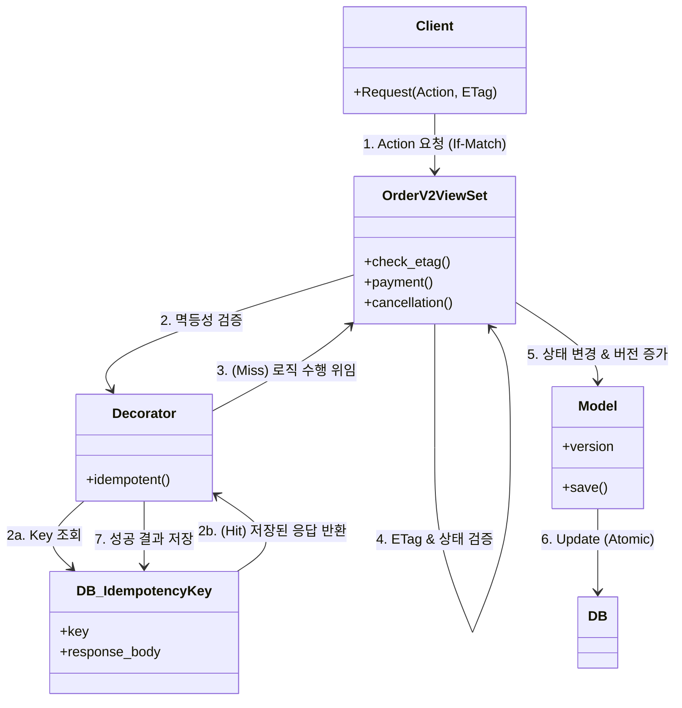

# B2_baedal (QuickEats): 배달 플랫폼 백엔드 리팩토링 및 고도화

> **"스타트업의 기술 부채(V1)를 넘어, 신뢰할 수 있는 대규모 아키텍처(V2)로의 도약"**
> 버전: v1.0 (MVP) ~ v2.0 (Refactoring)

---

## 🔹 목차

1. [프로젝트 개요](#1-프로젝트-개요)
2. [기술 스택 총괄](#2-기술-스택-총괄)
3. [버전별 개발 히스토리](#3-버전별-개발-히스토리)
    - [v1.0 - MVP (기능 중심 구현)](#v10---mvp-기능-중심-구현)
    - [v2.0 - 아키텍처 고도화 (안정성 강화)](#v20---아키텍처-고도화-안정성-강화)
4. [핵심 문제 해결 로그 (Deep Dive)](#4-핵심-문제-해결-로그-deep-dive)
    - [4.1 동시성 제어 (Race Condition)](#41-동시성-제어-race-condition)
    - [4.2 멱등성 보장 (Idempotency)](#42-멱등성-보장-idempotency)
    - [4.3 N+1 문제 및 성능 최적화](#43-n1-문제-및-성능-최적화)
    - [4.4 상태 관리 (State Machine)](#44-상태-관리-state-machine)
5. [아키텍처 요약](#5-아키텍처-요약)
6. [사용자 실행 가이드 (Manual Test)](#6-사용자-실행-가이드-manual-test)
7. [회고 및 결론](#7-회고-및-결론)

---

## 1. 프로젝트 개요

### 1.1 프로젝트 배경
**QuickEats(B2_baedal)**는 빠르게 성장하는 배달 플랫폼의 백엔드 서비스입니다. 초기 MVP(v1.0) 단계에서는 "빠른 기능 구현"에 초점을 맞추었으나, 사용자가 늘어나면서 다음과 같은 치명적인 문제들에 직면했습니다.

- **데이터 무결성 깨짐**: 동시에 주문 취소와 접수가 발생하면 상태가 꼬임.
- **중복 결제**: 네트워크 지연으로 인해 결제 요청이 두 번 처리됨.
- **성능 저하**: 주문 목록 조회 시 N+1 쿼리 발생으로 DB 부하 급증.

이 프로젝트는 이러한 기술 부채를 청산하고, **금융급 신뢰성(Reliability)**과 **확장성(Scalability)**을 갖춘 v2.0 아키텍처로 리팩토링하는 과정을 담고 있습니다.

### 1.2 핵심 목표
- **Consistency**: 낙관적 락(Optimistic Lock)을 도임하여 동시성 이슈 원천 차단.
- **Stability**: 멱등성(Idempotency) 키를 통해 중복 요청 방어.
- **Performance**: N+1 문제 해결 및 Side-loading 기법 적용.
- **Maintainability**: 모호한 업데이트 로직을 명시적인 Action-based API로 재설계.

---

## 2. 기술 스택 총괄

| 구분 | Technology | 선택 이유 |
|------|-----------|-----------|
| **Language** | Python 3.11 | 높은 생산성과 풍부한 생태계 |
| **Framework** | Django 5.2 + DRF | 강력한 ORM 및 **REST API** 생산성 |
| **Database** | PostgreSQL | 트랜잭션 안전성 및 JSONB 지원 |
| **Architecture** | Action-Oriented ViewSet | 행위 기반 리소스 설계 및 상태 관리 중앙화 |
| **Concurrency** | Optimistic Locking (ETag) | DB 락 부하 없이 애플리케이션 레벨 제어 |
| **Reliability** | Idempotency | 멱등성 키를 이용한 중복 요청 방지 |

---

## 3. 버전별 개발 히스토리

### v1.0 - MVP (기능 중심 구현)
- **특징**: 빠른 개발을 위해 로직을 View에 몰아넣음 (Fat View).
- **상태 관리**: 단순 문자열(`string`)로 상태 관리, 비즈니스 로직이 분산됨.
- **문제점**:
    - **Race Condition**: `black_BOX_test.py` 테스트 시 이중 갱신 발생.
    - **N+1**: Serializer에서 관계형 데이터 참조 시 쿼리 폭발.
    - **유지보수**: View 코드가 비대해져 수정이 어려움.

### v2.0 - 아키텍처 고도화 (안정성 강화)
- **특징**: **DDD(Domain Driven Design)** 개념 일부 도입, 행위(Action) 기반 API 설계.
- **개선 사항**:
    - **Optimistic Locking**: `version` 필드와 `ETag` 헤더 활용.
    - **Idempotency**: `@idempotent` 데코레이터와 **DB 모델**을 활용하여 중복 결제 방지.
    - **Action-Oriented**: 명시적인 `@action` 메서드(`payment`, `cancellation`)로 상태 전이 통제.
    - **Optimization**: `select_related` 및 Side-loading 패턴 적용.
- **결과**: `black_BOX_test.py` 테스트 통과 (412 Error 반환), N+1 문제 해결.

---

## 4. 핵심 문제 해결 로그 (Deep Dive)

### 4.1 동시성 제어 (Race Condition)

**문제(Problem):**
주문 상태가 `Preparing`(조리중)으로 바뀌는 순간에 고객이 `Cancel`(취소)을 요청하면, DB에 덮어쓰기(Lost Update)가 발생하여 "조리 중인데 취소된 주문"이라는 모순된 상태가 됩니다.

**해결(Solution): Optimistic Locking (낙관적 락)**
DB 락(비관적 락) 대신 애플리케이션 레벨에서 버전을 관리합니다.

1.  **Version Field**: `Order` 모델에 `version` 필드 추가.
2.  **ETag & If-Match**:
    -   GET 요청 시 서버가 `ETag: "order-1-v1"` 헤더 발급.
    -   클라이언트는 수정 요청(PUT/POST) 시 `If-Match: "order-1-v1"` 헤더 전송.
3.  **Validation**: 서버는 현재 버전과 `If-Match` 버전이 다르면 `412 Precondition Failed` 반환.

```python
# views.py (Logic)
def check_etag(self, request, order):
    if_match = request.headers.get('If-Match')
    # ... (ETag 검증 로직)
    if if_match != current_etag:
        return False, Response(status=412)
    return True, None
```

### 4.2 멱등성 보장 (Idempotency)

**문제(Problem):**
고객이 결제 버튼을 눌렀는데 응답이 늦어 다시 눌렀을 때(Retry), 서버가 이를 두 번의 결제로 처리하면 안 됩니다.

**해결(Solution): Idempotency Key & Decorator (DB 기반)**
동일한 `Idempotency-Key` 헤더를 가진 요청은 단 한 번만 처리되도록 보장합니다. Redis 대신 **DB 테이블**을 사용하여 영구적이고 신뢰성 있게 기록을 관리합니다.

```python
# decorators.py
def idempotent(func):
    def wrapper(view, request, *args, **kwargs):
        key = request.headers.get('Idempotency-Key')
        # ...
        # DB에서 키 조회
        existing_key = IdempotencyKey.objects.filter(key=uuid_key).first()
        if existing_key:
            return Response(existing_key.response_body, status=existing_key.response_status)
            
        response = func(view, request, *args, **kwargs)
        
        # 성공 응답 DB에 저장
        if 200 <= response.status_code < 300:
             IdempotencyKey.objects.create(
                key=uuid_key,
                response_status=response.status_code,
                response_body=response.data
            )
        return response
    return wrapper
```

### 4.3 N+1 문제 및 성능 최적화

**문제(Problem):**
주문 목록 20개를 조회할 때, 각 주문의 식당 정보(`Restaurant`)를 가져오기 위해 추가 쿼리가 20번 발생함 (Total 21 Quieries).

**해결(Solution): select_related & Side-loading**

1.  **select_related (Join)**:
    DB 레벨에서 JOIN을 사용하여 한 번의 쿼리로 데이터를 가져옵니다.
    ```python
    queryset = Order.objects.select_related('restaurant')
    ```

2.  **Side-loading (JSON Structure)**:
    중복되는 식당 정보를 매 주문마다 포함하지 않고, 별도의 `included` 섹션으로 분리하여 응답 크기를 줄입니다.
    ```json
    {
        "results": [ {"id": 1, "restaurant_id": 100}, {"id": 2, "restaurant_id": 100} ],
        "included": { "restaurants": [ {"id": 100, "name": "BBQ"} ] }
    }
    ```

### 4.4 상태 관리 (State Machine)

**문제(Problem):**
View에서 `if order.status == ...` 로직이 산재하여, 상태 전이 규칙(예: `Delivered` -> `Cancelled` 불가)을 파악하기 어려움.

**해결(Solution): REST Action & Explicit Check**
모호한 `PUT (update)` 대신 명시적인 Action API(`POST /orders/1/payment`)를 사용하고, 상태 검증 로직을 중앙화합니다.

```python
# views.py
@action(detail=True, methods=['post'])
def payment(self, request, pk=None):
    if order.status != Order.Status.PENDING_PAYMENT:
        return Response({"error": "Invalid state"}, status=400)
    # ... 결제 로직 ...
```

---

## 5. 아키텍처 요약



1.  **Presentation Layer (ViewSet + Decorator)**: HTTP 요청 파싱, 권한 확인, 멱등성/동시성 제어 (Gatekeeper).
2.  **Action Logic**: 명시적인 메서드를 통해 상태 전이 규칙을 엄격하게 관리.
3.  **Data Persistence (DB)**: PostgreSQL을 사용하여 서비스 데이터(`Order`)와 멱등성 키(`IdempotencyKey`)를 모두 안전하게 저장.

---

## 6. 사용자 실행 가이드 (Manual Test)

실제 서비스 흐름을 브라우저에서 체험해보는 방법입니다:

1.  **주문 생성**: `http://127.0.0.1:8000/api/v2/orders/` 접속.

    -   입력 폼에 `restaurant_name="치킨집"` 입력 후 **POST**.

    -   생성된 ID 기억 (예: 15). 상태: `pending_payment`.

2.  **결제 (고객)**: `http://127.0.0.1:8000/api/v2/orders/15/payment/` 접속.

    -   입력 폼에 `payment_method="card"`, `amount=20000` 입력 후 **POST**.

    -   **결과**: 상태가 `pending_acceptance`(접수대기)로 변경됨.

3.  **접수 (사장님)**: `http://127.0.0.1:8000/api/v2/orders/15/acceptance/` 접속.

    -   **POST** 버튼 클릭.

    -   **결과**: 상태가 `preparing`(조리중)으로 변경됨.

4.  **조리 완료 (사장님)**: `http://127.0.0.1:8000/api/v2/orders/15/preparation-complete/` 접속.

    -   **POST** 버튼 클릭.

    -   **결과**: 상태가 `ready_for_pickup`(픽업대기)으로 변경됨.

5.  **픽업 (라이더)**: `http://127.0.0.1:8000/api/v2/orders/15/pickup/` 접속.

    -   **POST** 버튼 클릭.

    -   **결과**: 상태가 `in_transit`(배달중)으로 변경됨.

6.  **배달 완료 (라이더)**: `http://127.0.0.1:8000/api/v2/orders/15/delivery/` 접속.

    -   **POST** 버튼 클릭.

    -   **결과**: 상태가 `delivered`(배달완료)로 변경됨.

**참고**: 각 단계 사이에 `http://127.0.0.1:8000/api/v2/orders/15/` 로 접속하여 상태 값(`status`)과 버전(`version`)이 바뀌는 것을 확인해 보세요.

**유의사항**: URL 오른쪽 끝편의 숫자는 시스템이 부여한 주문 ID입니다. 생성된 ID에 맞춰 숫자를 변경하여 진행하세요.

---

## 7. 회고 및 결론

> **"안정성은 기능의 일부가 아니라, 기능 그 자체다."**

초기 스타트업 단계(v1)에서는 "돌아가는 코드"가 중요했지만, 트래픽이 늘어나는 단계(v2)에서는 **"멈추지 않는 코드"**가 중요함을 배웠습니다.
특히 **동시성 이슈**와 **멱등성**은 테스트 코드(`black_BOX_test.py`) 없이는 발견하기 어려운 문제였으며, 이를 시스템 레벨에서 해결하는 과정에서 백엔드 엔지니어로서의 시야를 넓힐 수 있었습니다.

이 프로젝트는 단순한 배달 앱 클론이 아니라, **실제 금융/커머스 서비스에서 발생할 수 있는 데이터 정합성 문제를 해결하기 위한 기술적 모범 사례(Best Practice)**를 구축한 결과물입니다.

---

> **문서 작성**: B2_baedal Team
> **프로젝트 기간**: 2025-12 ~ 2026-01
